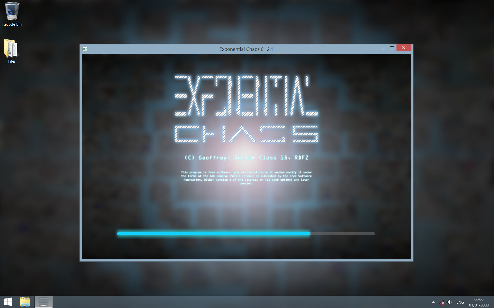
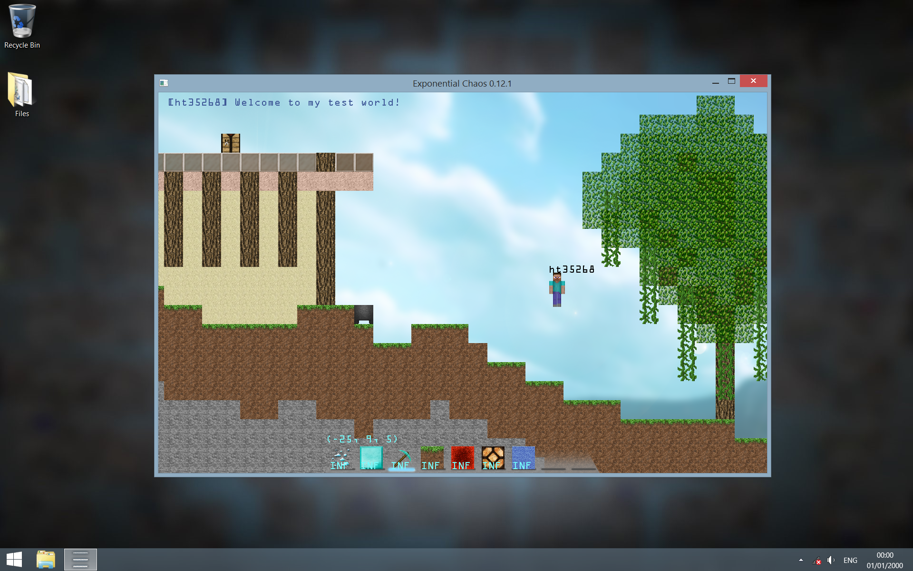
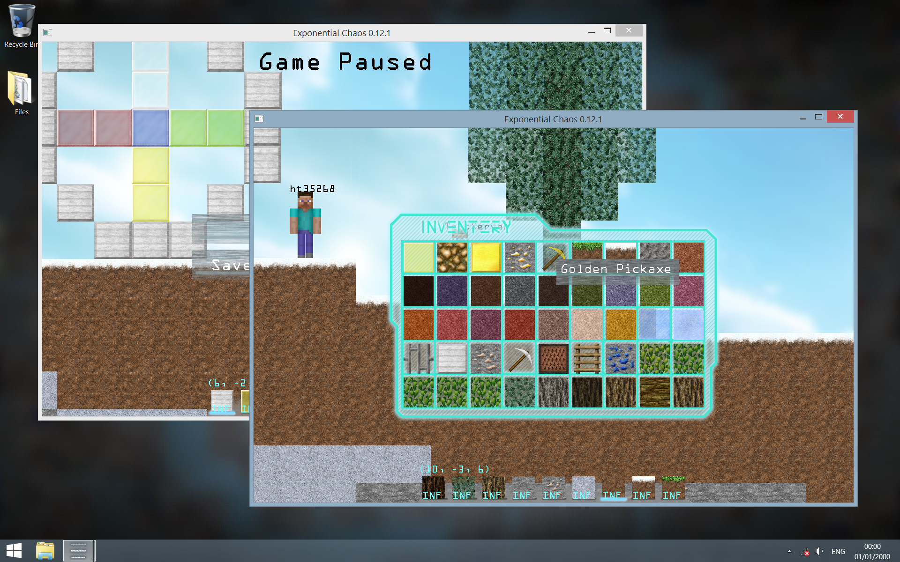

# Exponential Chaos

## License

Copyright (C) 2016  Geoffrey Tang.

This program is free software: you can redistribute it and/or modify
it under the terms of the GNU General Public License as published by
the Free Software Foundation, either version 3 of the License, or
(at your option) any later version.

This program is distributed in the hope that it will be useful,
but WITHOUT ANY WARRANTY; without even the implied warranty of
MERCHANTABILITY or FITNESS FOR A PARTICULAR PURPOSE.  See the
GNU General Public License for more details.

You should have received a copy of the GNU General Public License
along with this program. If not, see <http://www.gnu.org/licenses/>.

## Brief

**Exponential Chaos** is a 2D game designed purely in C++ and is initially
designed to be highly extensible and programmable. The main aim of this project
is to provide zero-level learners with useful learning materials on the following
subjects and developing tricks:

 * Programming in `C++11` and invoking related libraries
 * Creating large projects and refurbishing the program structure
 * Thread safety designs and related tweaks to avoid crashes
 * Debugging programs to eliminate segmentation faults
 * Basic `OpenGL` programming and related tweaks
 * Basic `JSON` library invocations and related semantic tweaks
 * Simple physics simulation engineering
 * Simple game mechanism designs and corresponding implementations

The game itself lacks a perfect interface, but is relatively visually competitive
compared to other games of the same type. The game can be extended in mostly
any way, and **the playability is strictly depended on the players' creativity**.
By using the *Developer's Resources*, you may create a whole new set of Resources
and create fully new experiences.

You are free and welcomed to fork this project as long as your forked projects
are legal complied to this project's license. New functions may be joined into
the master branch if considered nice by the maintainer.

The loading interface of Exponential Chaos. All resources are explicitly
developed and designed by @ht35268, you are free to use all textures located
under `exponential_chaos/textures`, under no matter what terms of conditions.



Exponential Chaos is integrated with a map design interface, called the *Creative
Mode*, inspired by the famous game *Minecraft*. Under this mode players are not
affected by gravity and free to fly anywhere. All entity types expected to
appear inside the creative inventory are available by pressing correlated keys.



To achieve the default targets of this game (PvP), there is also a mode called
the *Survival Mode*, inspired also by the famous game *Minecraft*. Under this
game mode, players can throw projectiles at each other and deal damage. How to
make use of this mechanism depends on the players.


Exponential Chaos has a built-in network management system, based on the open
source project *cross_network_library*. This provides multiplayer support, for
crowd-based map creations and PvP events.



## Manual

[License](./documentation/license.md)

[Installation](./documentation/installation.md)

[Version History](./documentation/updates.md)

## Developer's Resources

[Controls](./documentation/controls.md)

[Entities](./documentation/entitytypes.md)

[Entity Types](./documentation/entitytypes.md)

[Game Maps](./documentation/gamemaps.md)

[Resource Packs](./documentation/resourcepacks.md)

[Triggers](./documentation/triggers.md)

## Special Thanks

| Contributor    | Reason                                                                                           |
| :------------- | :----------------------------------------------------------------------------------------------- |
| **RDFZ/yjy**   | Well-known coach in *Informatics in Olympiad*, who led me to the world of coding.                |
| RDFZ/zsyzzsoft | For inspiring me of creating this game from his games ```Game01``` and ```Gravity Hazard```.     |
| RDFZ/SkyWalker | For supporting me continuously of this project and providing first-hand test results.            |
| RDFZ/BurstZero | For providing extensive support on algorithms in developing the network engine.                  |
| @xmcp          | For giving me special advices on working on GitHub and many useful development tools.            |
| @dramforever   | For providing tests related to this project and executive advices on many programming languages. |
